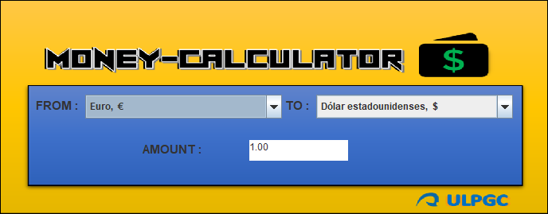
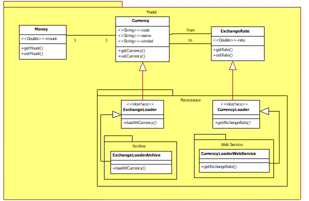

<h1 align="center"><b>Money Calculator App 💰 </b></h1>

## Description 📋

<strong>Money Calculator</strong> is a Java application that simplifies <strong>currency conversion efficiently</strong>. Using the <strong>Model-View-Controller (MVC) design pattern</strong> and the <strong>Observer pattern</strong>, the application provides an intuitive interface for performing currency conversions with ease.  

# 👥 Development Team (Ctrl + Click to view profiles)

## Features ✨

- **Currency Conversion:** Allows the user to enter the amount in a source currency and select the destination currency to get the converted amount.

- **Automatic Update:** Implements the Observer pattern to automatically update the interface when conversion data changes.

- **User-Friendly GUI:** Developed with Java Swing, the user interface is easy to understand and use.

## Project Structure 🏗️

The code follows the MVC pattern for clear and modular organization:

- **Model:** Contains business logic and manages exchange rates. The `MoneyCalculator` class performs conversion calculations and maintains the history.

- **View:** Represents the user interface. The `MoneyDisplayView, MoneyView, and MoneyEditView` classes handle the presentation and data input for conversions.

- **Controller:** Manages interactions between the user and the application. The `MoneyEditController` class handles user events and updates the model and view accordingly.

The Observer pattern is used to allow the view to update automatically when exchange rates change.

## API Integration 🌐

- An API is used to obtain updated exchange rates.

- Relevant components are located in the WebService package.

##

## Requirements 🛠️

- Java JDK 8 or higher.
- Java-compatible IDE (Eclipse).

## Interface Design 🎨

<ul align="center">		
    
</ul>

## Model Design 💻

<ul align="center">		
    
</ul>

## Usage Instructions 🚀

1. Clone the repository: `git clone https://github.com/AlejandroDavidArzolaSaavedra/MoneyCalculator`
2. Open the project in your preferred IDE.
3. Run the `MoneyCalculatorController` class to start the application.

## Contributions 🤝

</a>Contributions are appreciated! If you find bugs or have suggested improvements, create an issue or send a pull request🚀.
